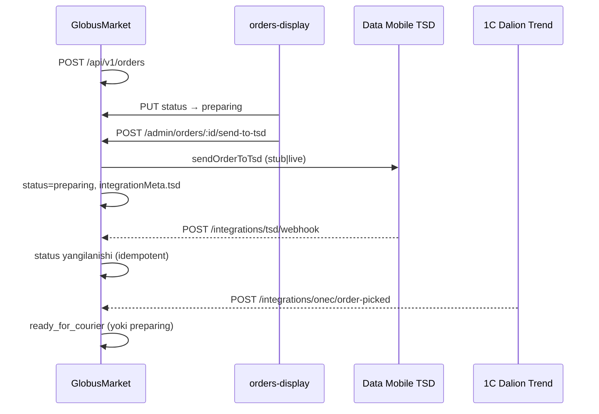

# GlobusMarket — TSD (Data Mobile) va 1C (Dalion Trend) integratsiyasi

Bu hujjat buyurtma oqimi uchun **integratsiyaga tayyor** qatlamni tavsiflaydi. Tashqi API hali to‘liq ulanmagan; `stub` rejimi log va `integrationMeta` yozadi.

## Oqim diagrammasi



## Muhit o‘zgaruvchilari

| O‘zgaruvchi | Default | Ma’nosi |
|-------------|---------|---------|
| `TSD_ENABLED` | `false` | TSD yuborish va webhook qabul qilish |
| `TSD_MODE` | `stub` | `stub` — log + stub external id; `live` — keyingi HTTP klient |
| `TSD_WEBHOOK_SECRET` | — | `x-integration-secret` yoki `x-webhook-secret` header |
| `TSD_AUTO_ON_PREPARING` | `false` | Status `preparing` bo‘lganda avtomatik yuborish |
| `TSD_AUTO_ON_CREATE` | `false` | Yangi buyurtmada avtomatik yuborish |
| `ONEC_ORDERS_ENABLED` | `false` | 1C buyurtma webhook |
| `ONEC_WEBHOOK_SECRET` | — | 1C webhook autentifikatsiyasi |
| `ONEC_PICK_TARGET_STATUS` | `ready_for_courier` | Yig‘ish tugagach: `ready_for_courier` yoki `preparing` |

Kelajakdagi `live` rejim uchun (hali kodda ulanmagan): `TSD_API_URL`, `TSD_API_KEY`, 1C HTTP endpoint va login.

## API endpointlar

| Metod | Yo‘l | Auth |
|-------|------|------|
| POST | `/api/v1/admin/orders/:id/send-to-tsd` | `x-admin-token` |
| POST | `/api/v1/integrations/tsd/webhook` | webhook secret |
| POST | `/api/v1/integrations/onec/order-picked` | webhook secret |
| POST | `/api/v1/integrations/datamobile/orders/:id/send` | admin (legacy nom) |
| POST | `/api/v1/integrations/dalion/orders/:id/picked` | admin (manual test) |
| GET | `/api/v1/integrations/status` | admin |

### send-to-tsd

Muvaffaqiyatda:

- `integrationMeta.tsd.externalId`, `sentAt`, `mode`
- Buyurtma statusi **`preparing`** (DB da; `sent_to_tsd` alias sifatida normalizatsiya qilinadi)

409 agar allaqachon yuborilgan bo‘lsa (`TSD_ALREADY_SENT`).

### TSD webhook

```json
{
  "orderId": "clxxx...",
  "orderNumber": "100042",
  "status": "picking",
  "externalId": "dm-12345"
}
```

Header: `x-integration-secret: <TSD_WEBHOOK_SECRET>`

Statuslar `src/order-status.js` orqali normalizatsiya qilinadi (`picking` → `preparing`, `picked` → `ready_for_courier`).

Bir xil `orderId:status:externalId` kaliti qayta kelganda javob `duplicate: true` (idempotent).

### 1C pick complete

```json
{
  "orderId": "clxxx...",
  "onecDocumentId": "DOC-7788",
  "pickedAt": "2026-05-17T12:00:00.000Z"
}
```

Header: `x-integration-secret: <ONEC_WEBHOOK_SECRET>`

## Ma’lumotlar bazasi

`Order.integrationMeta` (JSONB) — TSD va 1C holati. Alohida ustunlar shart emas.

## Stub vs live

| Rejim | TSD | 1C export |
|-------|-----|-----------|
| `stub` + enabled | Konsol log, `tsd-stub-{orderNumber}-{ts}` id | `1c-stub-{orderNumber}` hujjat id |
| `live` | Hozircha stub kabi; HTTP klient keyingi bosqich | HTTP klient keyingi bosqich |

## Keyingi qadamlar (tashqi jamoalar)

1. **Data Mobile**: haqiqiy `sendOrderToTsd` HTTP, webhook URL va `TSD_WEBHOOK_SECRET` almashish.
2. **1C Dalion Trend**: buyurtma eksport va `order-picked` webhook kontraktini tasdiqlash.
3. Production: `TSD_ENABLED=true`, `ONEC_ORDERS_ENABLED=true`, secretlarni `.env` da saqlash.
4. `orders-display` da TSD tugmasi — `TSD_ENABLED` yoqilganda server 503 bermasligi uchun.
